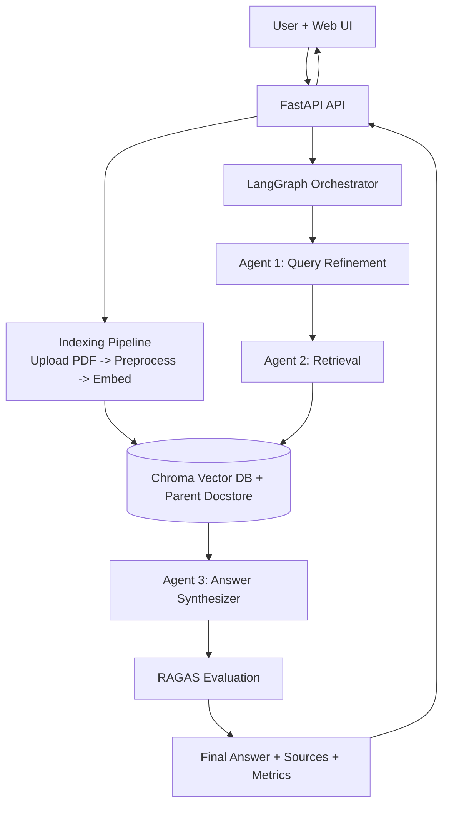

# Application Architecture

High-level architecture (simple view).

```mermaid
flowchart TD
  U[User + Web UI] --> API[FastAPI API]

  API --> IDX[Indexing Pipeline\nUpload PDF -> Preprocess -> Embed]
  IDX --> STORE[(Chroma Vector DB + Parent Docstore)]

  API --> ORCH[LangGraph Orchestrator]
  ORCH --> A1[Agent 1: Query Refinement]
  A1 --> A2[Agent 2: Retrieval]
  A2 --> STORE
  STORE --> A3[Agent 3: Answer Synthesizer]
  A3 --> RAGAS[RAGAS Evaluation]
  RAGAS --> OK[Final Answer + Sources + Metrics]
  OK --> API
  API --> U
```
