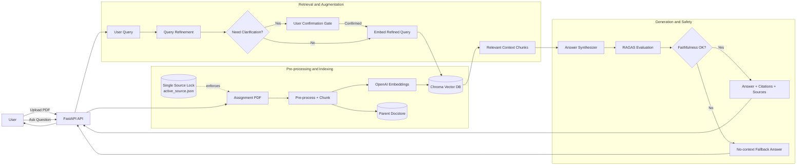

# Application Architecture

Simple architecture view of the implemented flow in `app/api.py`, `app/langgraph_workflow.py`, `app/index.py`, and `app/retriver.py`.

```mermaid
flowchart LR
  USER[User] -->|Upload PDF| API[FastAPI API]
  USER -->|Ask Question| API

  subgraph P1[Pre-processing and Indexing]
    PDF[Assignment PDF] --> PRE[Pre-process + Chunk]
    PRE --> E1[OpenAI Embeddings]
    E1 --> VDB[(Chroma Vector DB)]
    PRE --> PDS[(Parent Docstore)]
    LOCK[(Single Source Lock\nactive_source.json)] -.enforces.-> PDF
  end

  subgraph P2[Retrieval and Augmentation]
    Q[User Query] --> REF[Query Refinement]
    REF --> CONF{Need Clarification?}
    CONF -->|Yes| CG[User Confirmation Gate]
    CG -->|Confirmed| E2[Embed Refined Query]
    CONF -->|No| E2
    E2 --> VDB
    VDB --> CTX[Relevant Context Chunks]
  end

  subgraph P3[Generation and Safety]
    CTX --> SYN[Answer Synthesizer]
    SYN --> RAGAS[RAGAS Evaluation]
    RAGAS --> SAFE{Faithfulness OK?}
    SAFE -->|Yes| OUT[Answer + Citations + Sources]
    SAFE -->|No| FALLBACK[No-context Fallback Answer]
  end

  API --> PDF
  API --> Q
  OUT --> API
  FALLBACK --> API
  API --> USER
```
