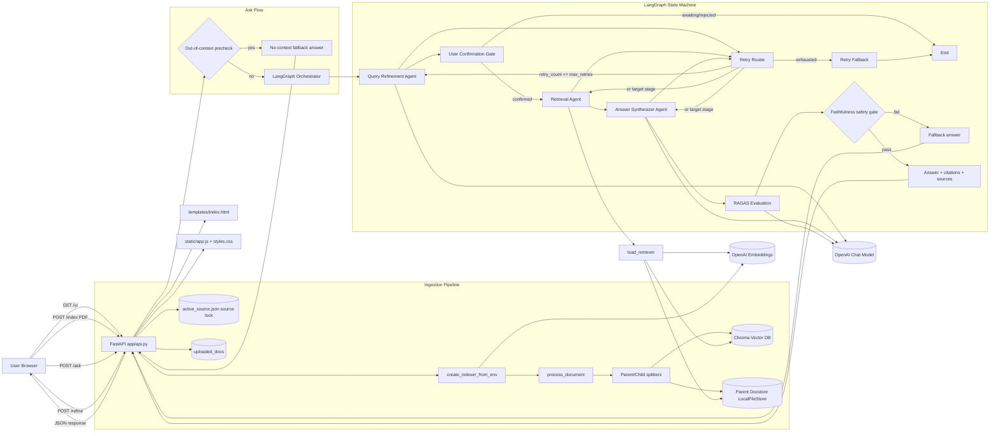

# Application Architecture

This diagram reflects the implemented flow in `app/api.py`, `app/langgraph_workflow.py`, `app/index.py`, and `app/retriver.py`.

```mermaid
flowchart LR
  U[User Browser] -->|GET /ui| API[FastAPI app/api.py]
  API --> T[templates/index.html]
  API --> S[static/app.js + styles.css]
  U -->|POST /index PDF| API
  U -->|POST /ask| API
  U -->|POST /refine| API

  subgraph ING[Ingestion Pipeline]
    API --> IDX[create_indexer_from_env]
    IDX --> PP[process_document]
    PP --> SPLIT[Parent/Child splitters]
    SPLIT --> VS[(Chroma Vector DB)]
    SPLIT --> DS[(Parent Docstore LocalFileStore)]
    API --> LOCK[(active_source.json source lock)]
    API --> UP[(uploaded_docs)]
  end

  subgraph ASK[Ask Flow]
    API --> OOC{Out-of-context precheck}
    OOC -->|yes| FB1[No-context fallback answer]
    OOC -->|no| LG[LangGraph Orchestrator]
  end

  subgraph WG[LangGraph State Machine]
    LG --> QR[Query Refinement Agent]
    QR --> CG[User Confirmation Gate]
    CG -->|confirmed| RA[Retrieval Agent]
    CG -->|awaiting/rejected| END1[End]
    RA --> SA[Answer Synthesizer Agent]
    SA --> EVAL[RAGAS Evaluation]
    EVAL --> SG{Faithfulness safety gate}
    SG -->|fail| FB2[Fallback answer]
    SG -->|pass| RESP[Answer + citations + sources]
    QR --> RR[Retry Router]
    RA --> RR
    SA --> RR
    RR -->|retry_count <= max_retries| QR
    RR -->|or target stage| RA
    RR -->|or target stage| SA
    RR -->|exhausted| RF[Retry Fallback]
    RF --> END1
  end

  RA --> RET[load_retriever]
  RET --> VS
  RET --> DS

  QR --> OPENAI[(OpenAI Chat Model)]
  SA --> OPENAI
  IDX --> EMB[(OpenAI Embeddings)]
  RET --> EMB
  EVAL --> OPENAI

  FB1 --> API
  FB2 --> API
  RESP --> API
  API -->|JSON response| U
```
