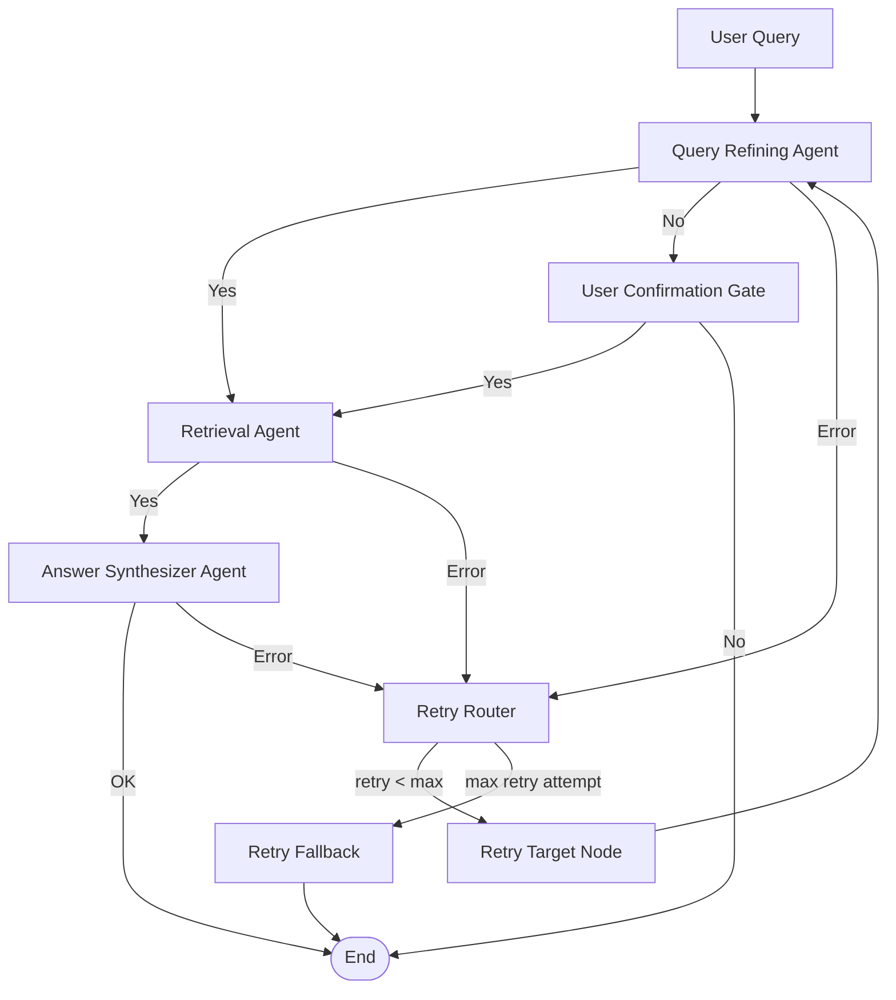

# Application Architecture

Replicated workflow sketch (same structure and routing).

```mermaid
flowchart TD
  UQ[User Query] --> QR[Query Refining Agent]

  QR -->|Yes| RA[Retrieval Agent]
  QR -->|No| UCG[User Confirmation Gate]
  UCG -->|Yes| RA
  UCG -->|No| END([End])

  RA -->|Yes| ASA[Answer Synthesizer Agent]
  ASA -->|OK| END

  QR -->|Error| RR[Retry Router]
  RA -->|Error| RR
  ASA -->|Error| RR

  RR -->|retry < max| RTN[Retry Target Node]
  RTN --> QR
  RR -->|max retry attempt| RF[Retry Fallback]
  RF --> END
```
