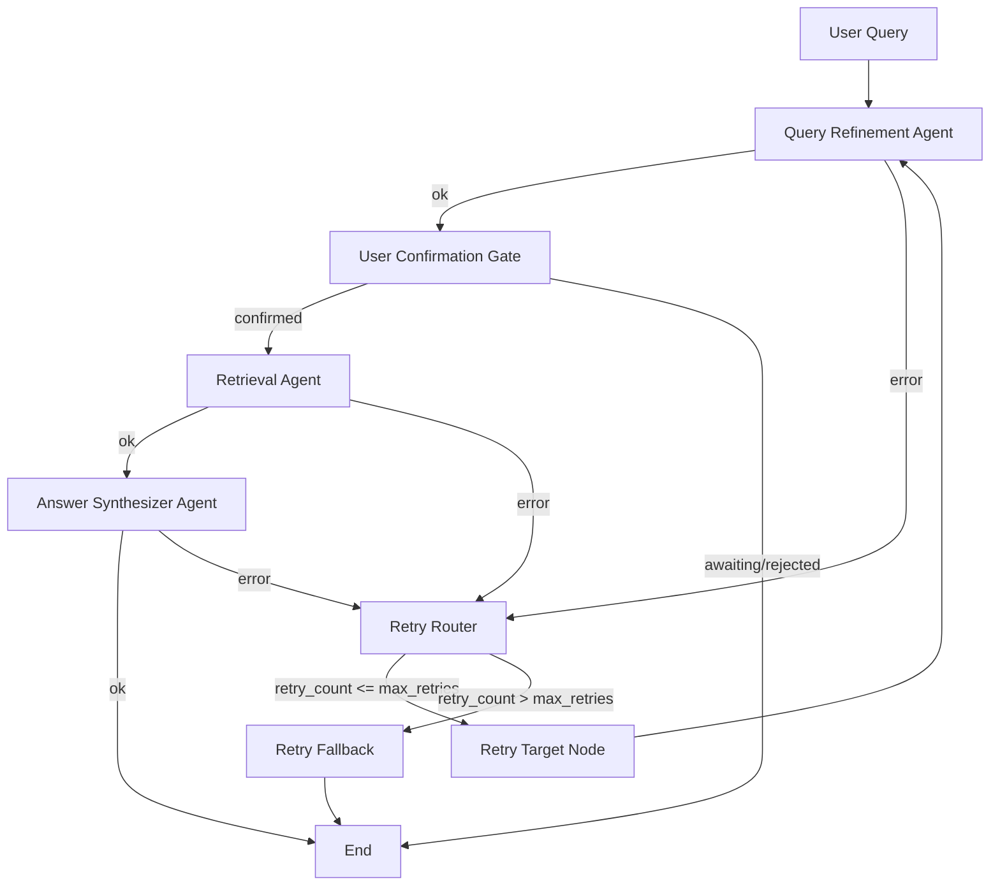

# LangGraph Workflow Challenge - RAG Application

This project implements a LangGraph-based orchestration workflow for document-grounded Q&A.
It ingests one assignment PDF, retrieves relevant evidence, generates a cited answer, and runs RAGAS-based quality signaling.

## Architecture
- Full architecture diagram: [ARCHITECTURE.md](./ARCHITECTURE.md)

## 1) What This Implements
- State-driven LangGraph orchestration (not a linear chain)
- Three required agents:
  - Query Refinement Agent
  - Retrieval Agent
  - Answer Synthesizer Agent
- User confirmation gate before retrieval when query is ambiguous
- Conditional routing + retry loops with max retry fallback
- Single-PDF knowledge source enforcement
- Source attribution (chunk/page) and reasoning summary
- RAGAS evaluation metrics in API + UI

## 2) Project Structure
```text
app/
  api.py                  # FastAPI routes, ask flow, gating, source filtering
  langgraph_workflow.py   # LangGraph state machine + retry loops
  index.py                # PDF ingestion, chunking, embedding, storage
  pre_process.py          # PDF text cleaning
  retriver.py             # Retriever loading
  evaluate_ragas.py       # RAGAS evaluation
static/
  app.js                  # UI behavior and rendering
  styles.css
templates/
  index.html
data/
  chroma_db/              # Vector store persistence
  parent_docs/            # Parent docstore persistence
  active_source.json      # Enforced single-PDF source lock
uploaded_docs/
README.md
requirements.txt
```

## 3) Setup
```bash
python -m venv .venv
.venv\Scripts\activate
pip install -r requirements.txt
```

Create `.env`:
```env
OPENAI_API_KEY=...
OPENAI_CHAT_MODEL=gpt-4o-mini
OPENAI_EMBEDDING_MODEL=text-embedding-3-small
PERSIST_DIRECTORY=./data/chroma_db
CHROMA_COLLECTION_NAME=local_hf_pdr
PARENT_DOCS_DIRECTORY=./data/parent_docs
ANSWER_FAITHFULNESS_THRESHOLD=0.7
WORKFLOW_MAX_RETRIES=2
RELEVANCE_MAX_DISTANCE=1.3
SOURCE_LOCK_PATH=./data/active_source.json
```

Run:
```bash
uvicorn app.api:app --reload --port 8000
```

UI: `http://127.0.0.1:8000/ui`

## 4) Ingestion Decisions
- Loader: PDF only (assignment source restriction enforced)
- Parent chunking: `chunk_size=1500`, `chunk_overlap=100`
- Child chunking: `chunk_size=300`, `chunk_overlap=50`
- Embeddings: `OpenAIEmbeddings` (`text-embedding-3-small` by default)
- Vector store: Chroma (persistent)
- Citation metadata persisted:
  - `doc_id` (chunk/parent mapping)
  - `page`
  - `source`

## 5) LangGraph Workflow Overview


## 6) State Schema (Stored Between Nodes)
Core fields in `WorkflowState`:
- Inputs:
  - `user_query`
  - `user_confirmation`
  - `skip_refinement`
- Refinement output:
  - `refined_query`
  - `needs_clarification`
  - `clarifying_questions[]`
  - `assumptions[]`
  - `structured_prompt`
  - `confirmed_query`
  - `confirmation_status`
- Retrieval output:
  - `retrieved_context[]` with `{chunk_id, page, source, text, score}`
- Answer output:
  - `answer`
  - `citations[]` with `{claim, chunk_id, page}`
  - `reasoning_summary`
- Retry loop state:
  - `retry_count`
  - `max_retries`
  - `retry_target`
  - `last_error`

## 7) Follow-up / Clarification Handling
- Refinement detects ambiguity and may generate clarifying questions.
- If clarification is required, execution pauses (`confirmation_status=awaiting_confirmation`).
- User can:
  - reply `yes` to proceed with refined query
  - reply `no` to stop and rephrase
  - send a clearer new query, which starts a fresh run

## 8) Citation Production (Chunk/Page Mapping)
- Retrieval returns top-k chunks with metadata.
- Synthesizer is prompted to return citations per claim:
  - `claim -> chunk_id/page`
- API deduplicates repeated source rows for cleaner UI display while keeping top-k retrieval internally.

## 9) Confidence / Hallucination Gating (Threshold Logic)
- Evaluation uses RAGAS (`faithfulness`, `answer_relevancy`).
- App derives `hallucination` from faithfulness threshold:
  - `faithfulness < ANSWER_FAITHFULNESS_THRESHOLD` => hallucination `Yes`
- If hallucination/low-faithfulness is detected, answer is replaced with:
  - `Sorry, I could not find relevant information from the given context.`
- For out-of-context queries, app returns the same fallback without refinement/retrieval answering.

## 10) Retry Loops
- Failing stages (`query_refinement`, `retrieval`, `answer_synthesizer`) do not hard-fail immediately.
- Flow:
  - mark error -> increment retry state -> route to retry router
  - retry target stage while `retry_count <= max_retries`
  - otherwise return retry fallback answer

## 11) API Endpoints
- `GET /` health
- `GET /ui` UI
- `POST /index` ingest/index one PDF (single-source enforced)
- `POST /ask` full workflow (refinement -> confirmation -> retrieval -> synthesis -> evaluation)
- `POST /refine` refinement-only endpoint

## 12) Trade-offs
- Chroma + local persistence is simple and fast for a challenge, but not multi-tenant production scale.
- Single-PDF enforcement meets assignment constraints but is restrictive for general RAG use.
- Pre-check out-of-context gating improves safety but may require threshold tuning for edge queries.
- LLM-based agents are flexible but can occasionally need retries for malformed outputs.

## 13) Next-Step Improvements
- Add per-node latency/trace observability.
- Add automated offline benchmark set for regression evaluation.
- Add stricter citation validation (claim coverage checks).
- Add session IDs for multi-user isolation instead of host-based session keying.
